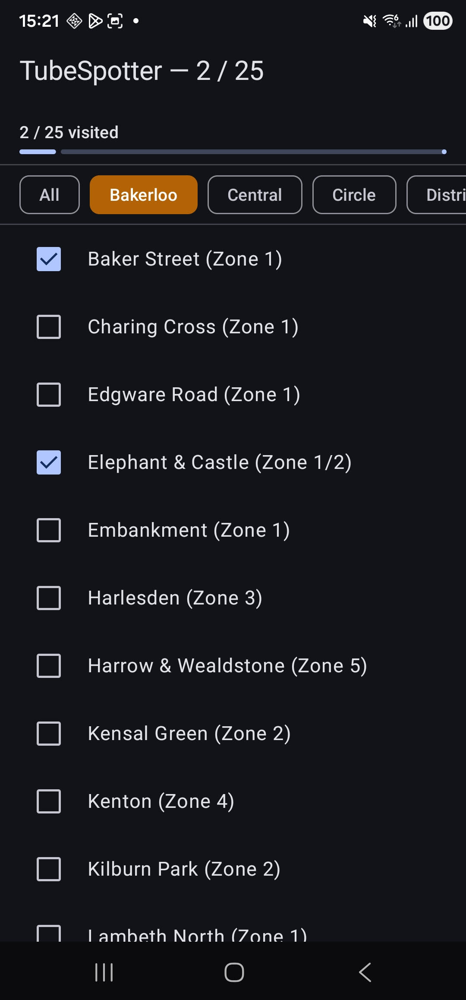
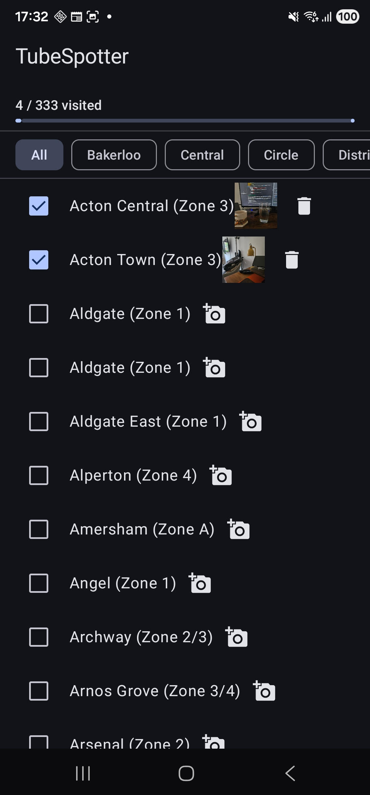
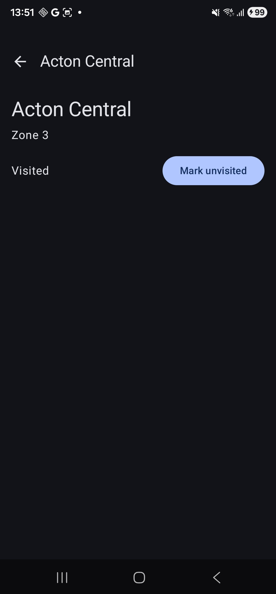

# Log

### Verification checklist
- `./gradlew test` - passing
- Run on emulator - working
- Kill and restart - data persists
- `./gradlew lint` - passing

## Phase One

### Built
- Room database with 3 tables, pre-seeded with 272 stations across 11 lines
- Clean architecture with data → domain → presentation separation
- Hilt dependency injection wired through the full stack
- MVI pattern via BaseViewModel with StateFlow + Channel
- Screen/Content composable split
- Unit tests for use cases and ViewModel

### Android concepts covered
- Gradle version catalogs and dependency management
- KSP vs KAPT and why ecosystem compatibility matters
- Room: entities, DAOs, database class, seed callbacks
- Hilt: component scopes, @Provides vs @Binds, @HiltViewModel
- Flow as a live query mechanism
- collectAsStateWithLifecycle() and why it's preferred over collectAsState()
- LazyColumn with stable keys
- UnconfinedTestDispatcher for ViewModel tests

### Screenshot

## Phase Two

### Built
- Line filter chips — horizontal scrollable row, one per TfL line
- Progress header with visited count and LinearProgressIndicator
- Deduplicated station seed data — one row per real-world station, cross-ref table for line membership
- Two new use cases: GetAllLinesUseCase, GetStationsByLineUseCase
- Extended StationRepository with getAllLines() and getStationsByLineId()
- Unit tests for new use cases and updated ViewModel tests

### Android concepts covered
- `flatMapLatest` — switching between data streams reactively based on UI state
- Room JOIN queries — filtering stations by line via the cross-ref table
- `LazyRow` with `FilterChip` for horizontal scrollable filter UI
- `LinearProgressIndicator` from Material 3
- `android.graphics.Color.parseColor()` for hex string → Compose Color conversion
- Why the same station needs only one DB row with multiple cross-ref entries (correct relational modelling)

### Screenshot

## Phase Three

### Built
- FileProvider declaration in AndroidManifest + `file_paths.xml` config for external storage access
- `PhotoStorage` class — creates temp files in `getExternalFilesDir("Pictures")`, returns content URIs via FileProvider, deletes files by path
- `updatePhotoUri` and `clearPhotoUri` DAO queries on `StationDao`
- `SaveStationPhotoUseCase` and `DeleteStationPhotoUseCase`
- `photoUri` field added to `Station` domain model and `StationEntity`
- Two new side effects: `LaunchCamera(stationId, uri)` and `ShowDeleteConfirmation(stationId, uri)`
- `pendingPhotoStationId` and `pendingPhotoUri` in `StationListUiState` to survive the camera round-trip
- `TakePhoto`, `PhotoCaptured`, `DeletePhoto`, `DeletePhotoConfirmed`, `StorePendingPhoto` actions added to `StationListUiAction`
- Camera launcher via `rememberLauncherForActivityResult(TakePicture)` in `StationListScreen`
- Side effect collection in `LaunchedEffect` — launches camera or shows delete confirmation dialog
- `AsyncImage` thumbnail in `StationItem` when a photo exists; camera icon when it doesn't; delete icon overlay
- Unit tests updated for new ViewModel actions

### Android concepts covered
- `FileProvider` — why apps can't share raw file paths with the camera, and how a content URI grants temporary read/write permission to another app
- `ActivityResult` API — `rememberLauncherForActivityResult` + `TakePicture` contract as the modern replacement for `onActivityResult`
- Why `TakePicture` returns only a `Boolean` — the URI must be prepared before launch and stored in state to be usable in the callback
- Side effects as the correct channel for one-shot platform actions (camera launch) from a ViewModel — never launch an Intent directly from a ViewModel
- Pending photo state — why the stationId must be held in `UiState` across the camera round-trip and cannot be passed through the callback
- Coil `AsyncImage` — declarative async image loading with a placeholder/fallback
- `getExternalFilesDir` — app-private external storage that doesn't require `READ/WRITE_EXTERNAL_STORAGE` permissions

### Screenshot

## Phase Four

### Built
- Navigation 3 (`NavDisplay`, `NavBackStack`) with `@Serializable` type-safe route objects
- `Routes.kt` — `StationListRoute`, `StationDetailRoute(stationId)`, `AchievementsRoute` implementing `NavKey`
- `TubeSpotterScaffold` — Material 3 `Scaffold` with `NavigationBar` bottom nav shell; bar hidden on detail screen
- `TopLevelDestination` enum — defines Stations and Achievements tabs with icons and routes
- `StationDetailScreen` with full MVI: `StationDetailUiState` (sealed interface), `StationDetailUiAction`, `StationDetailUiSideEffect`, `StationDetailViewModel`
- `GetStationDetailUseCase` + `getStationById` DAO query
- Assisted injection for `StationDetailViewModel` — `stationId` passed at ViewModel creation time via `@AssistedInject` and `@HiltViewModel(assistedFactory = ...)`
- Per-station ViewModel keying via `hiltViewModel(key = stationId.toString())` to prevent stale instance reuse
- Back navigation via `GoBack` side effect — ViewModel signals, Screen pops the back stack
- `clickable` on `StationItem` row to trigger `SelectStation` action → `NavigateToDetail` side effect

### Android concepts covered
- Navigation 3 API — `NavBackStack` as a `SnapshotStateList`, `NavDisplay`, `entryProvider` DSL, and why each entry has its own `ViewModelStoreOwner`
- `@Serializable` route objects — type-safe navigation arguments replacing string-based routes; why `@Serializable` enables process death restoration
- `NavKey` marker interface — what Navigation 3 requires to accept a class as a valid back stack destination
- `sealed interface` for UiState — models Loading/Content states for screens that load a single entity, vs `data class` for screens that always have data
- Assisted injection — how to pass runtime values (unknown at compile time) to a `@HiltViewModel`; when Hilt's normal compile-time wiring isn't sufficient
- ViewModel caching — why `hiltViewModel()` returns the same instance without a unique `key`, and how `key` creates distinct instances per destination
- Process death — how Android silently kills background processes and why `@Serializable` routes enable transparent restoration of the back stack

### Screenshot
