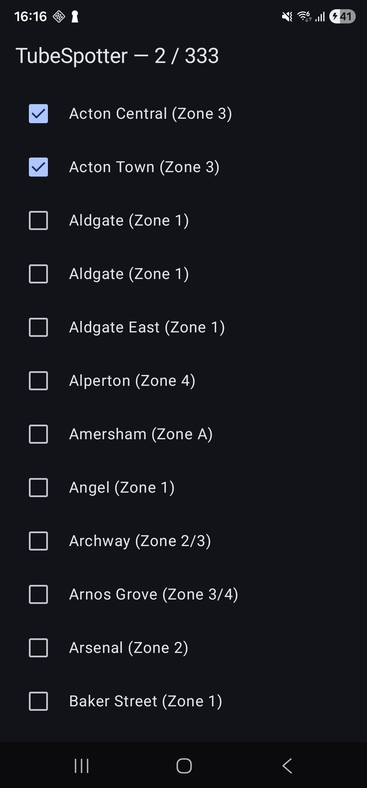

# Log

### Verification checklist
- `./gradlew test` - passing
- Run on emulator - working
- Kill and restart - data persists
- `./gradlew lint` - passing

## Phase One

### Built
- Room database with 3 tables, pre-seeded with 272 stations across 11 lines
- Clean architecture with data → domain → presentation separation
- Hilt dependency injection wired through the full stack
- MVI pattern via BaseViewModel with StateFlow + Channel
- Screen/Content composable split
- Unit tests for use cases and ViewModel

### Android concepts covered
- Gradle version catalogs and dependency management
- KSP vs KAPT and why ecosystem compatibility matters
- Room: entities, DAOs, database class, seed callbacks
- Hilt: component scopes, @Provides vs @Binds, @HiltViewModel
- Flow as a live query mechanism
- collectAsStateWithLifecycle() and why it's preferred over collectAsState()
- LazyColumn with stable keys
- UnconfinedTestDispatcher for ViewModel tests

### Screenshot

## Phase Two

### Built
- Line filter chips — horizontal scrollable row, one per TfL line
- Progress header with visited count and LinearProgressIndicator
- Deduplicated station seed data — one row per real-world station, cross-ref table for line membership
- Two new use cases: GetAllLinesUseCase, GetStationsByLineUseCase
- Extended StationRepository with getAllLines() and getStationsByLineId()
- Unit tests for new use cases and updated ViewModel tests

### Android concepts covered
- `flatMapLatest` — switching between data streams reactively based on UI state
- Room JOIN queries — filtering stations by line via the cross-ref table
- `LazyRow` with `FilterChip` for horizontal scrollable filter UI
- `LinearProgressIndicator` from Material 3
- `android.graphics.Color.parseColor()` for hex string → Compose Color conversion
- Why the same station needs only one DB row with multiple cross-ref entries (correct relational modelling)

### Screenshot
